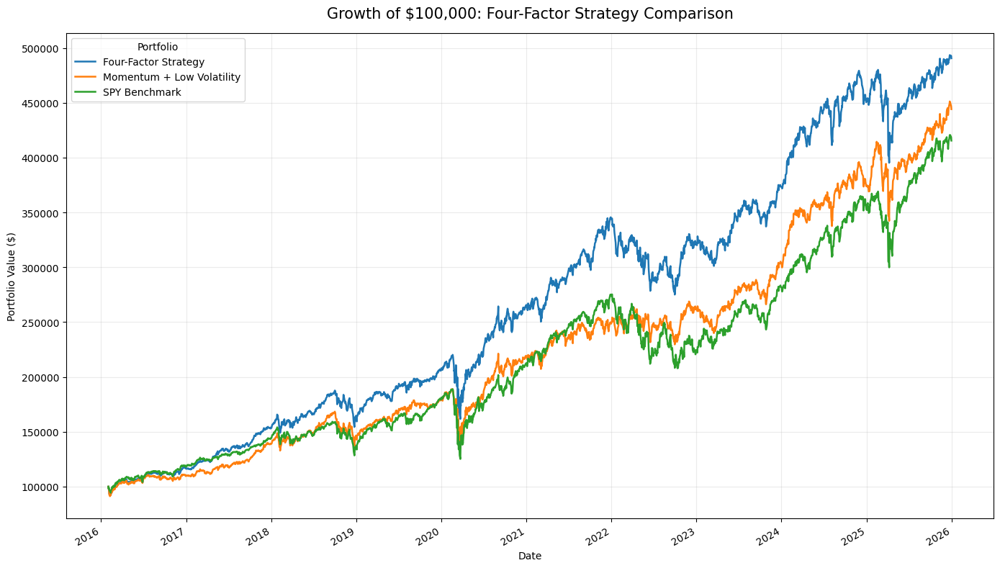

# Multi-Factor Equity Portfolio Backtester

A reproducible Google Colab research project that constructs and evaluates a
monthly rebalanced U.S. large-cap equity portfolio using **momentum, value,
quality, and low-volatility factors**.

The notebook combines daily market prices, point-in-time SEC filing data, a
Treasury-based risk-free rate, realistic rebalance timing, naturally drifting
portfolio weights, and transaction-cost modeling.



## Project highlights

- 50-stock U.S. large-cap research universe
- January 2016 through December 2025 signal period
- Monthly rebalancing into the top 15 ranked stocks
- Equal 6.67% target weights
- 10-basis-point transaction cost per dollar traded
- Point-in-time SEC fundamentals using actual filing dates
- Cross-sectional winsorization and z-score standardization
- Strategy, two-factor model, and SPY comparison
- Drawdown, turnover, alpha, beta, VaR, Expected Shortfall, and robustness tests
- Successful clean-session execution from top to bottom in Google Colab

## Factor definitions

### Momentum

Twelve-minus-one-month momentum compares the price approximately one year ago
with the price approximately one month ago. The most recent month is skipped.

### Value

The value score combines:

- Earnings yield
- Free-cash-flow yield
- Book-to-market ratio

### Quality

The quality score combines:

- Return on assets
- Gross profitability
- Operating margin
- Low liabilities-to-assets

### Low volatility

Annualized historical volatility is estimated from the previous 63 trading
days. Lower volatility receives a higher score.

Each raw component is winsorized at the 5th and 95th cross-sectional
percentiles and converted into a monthly z-score. The four broad factors receive
equal 25% weights.

## Backtest timing

1. Signals are measured at the month-end close.
2. The portfolio is rebalanced at the close of the next trading day.
3. New positions begin earning returns on the following close-to-close period.
4. Weights drift naturally between monthly rebalances.
5. Gross purchases plus sales determine transaction costs.

This timing convention avoids allowing the strategy to earn returns before its
signals could have been observed and traded.

## Common-period results

The figures below reflect the successful executed notebook included in this
repository. The common comparison period is **February 1, 2016 through
December 31, 2025**.

| Metric | Four-Factor Strategy | Two-Factor Strategy | SPY |
|---|---:|---:|---:|
| Total return | 390.59% | 344.18% | 315.49% |
| CAGR | 17.40% | 16.23% | 15.45% |
| Annualized volatility | 16.92% | 16.99% | 17.96% |
| Sharpe ratio | 0.903 | 0.841 | 0.768 |
| Sortino ratio | 1.110 | 1.032 | 0.923 |
| Maximum drawdown | -26.57% | -28.46% | -33.72% |
| Annualized alpha vs. SPY | 3.62% | 3.02% | — |
| Beta vs. SPY | 0.846 | 0.817 | — |

The four-factor model finished at approximately **$490,590** from a hypothetical
$100,000 initial investment over the common evaluation period.

## Robustness observations

- The four-factor strategy produced positive CAGR in all three tested
  subperiods.
- It outperformed SPY in the 2016–2019 and 2020–2022 subperiods.
- It underperformed SPY during 2023–2025 and recorded negative alpha in that
  subperiod.
- At the base 10-basis-point cost assumption, average one-way monthly turnover
  was **18.63%**.
- Increasing transaction costs from 0 to 50 basis points reduced CAGR from
  approximately **17.92%** to **15.36%**, but the strategy remained profitable
  in the historical test.

These observations are more informative than presenting only the strongest
full-period result.

## Repository structure

```text
multi_factor_equity_backtester/
├── notebooks/
│   └── multi_factor_equity_backtester.ipynb
├── images/
│   ├── annual_returns.png
│   ├── cumulative_transaction_costs.png
│   ├── drawdown_comparison.png
│   ├── monthly_returns_heatmap.png
│   ├── monthly_turnover.png
│   ├── portfolio_comparison.png
│   └── transaction_cost_sensitivity.png
├── outputs/
│   ├── annual_returns.csv
│   ├── final_portfolio_values.csv
│   ├── latest_portfolio_holdings.csv
│   ├── performance_metrics.csv
│   ├── subperiod_performance.csv
│   └── transaction_cost_sensitivity.csv
├── docs/
│   ├── INTERVIEW_GUIDE.md
│   └── RESUME_BULLETS.md
├── .gitignore
├── CITATIONS.md
├── LICENSE
├── README.md
└── requirements.txt
```

## Running the project in Google Colab

1. Open `notebooks/multi_factor_equity_backtester.ipynb` in Colab.
2. Open the **Secrets** panel using the key icon.
3. Add:
   - `SEC_CONTACT_NAME`
   - `SEC_CONTACT_EMAIL`
4. Enable notebook access for both secrets.
5. Select **Runtime → Restart session and run all**.

The SEC contact values are read privately at runtime and are not stored in the
notebook.

## Running locally

The notebook was designed and tested in Google Colab. To install the principal
dependencies locally:

```bash
python -m venv .venv
source .venv/bin/activate
pip install -r requirements.txt
```

On Windows PowerShell:

```powershell
python -m venv .venv
.venv\Scripts\Activate.ps1
pip install -r requirements.txt
```

Some Colab-specific features, including the Secrets interface and final browser
download cell, require small changes outside Colab.

## Important limitations

- The universe is a fixed list selected with present-day knowledge, creating
  survivorship and selection bias.
- The backtest uses daily closing prices rather than intraday execution prices.
- Bid–ask spreads and market impact are approximated through fixed costs.
- Annual SEC data is used instead of a complete quarterly trailing-twelve-month
  accounting pipeline.
- Financial and non-financial companies do not always report accounting
  concepts in directly comparable ways.
- The portfolio is not sector neutral.
- The parameter choices were evaluated over the same period shown in the
  results, creating in-sample design risk.
- Yahoo Finance is suitable for educational research but not a production
  institutional data feed.

A stronger next version would use historical index constituents, quarterly
point-in-time fundamentals, sector-neutral ranks, market-capacity constraints,
and a held-out out-of-sample evaluation.

## Disclaimer

This project is for education and research only. It is not investment advice,
and historical backtest performance does not guarantee future results.
